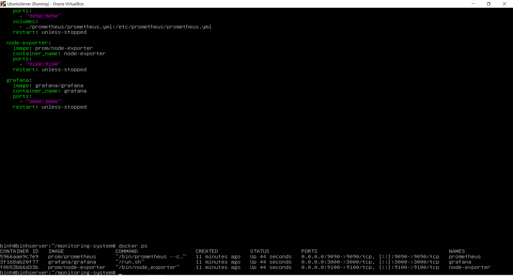
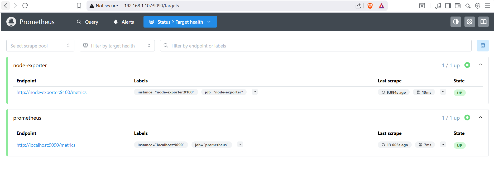
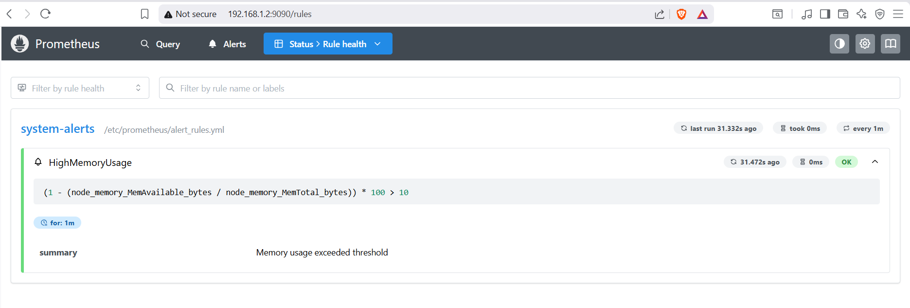
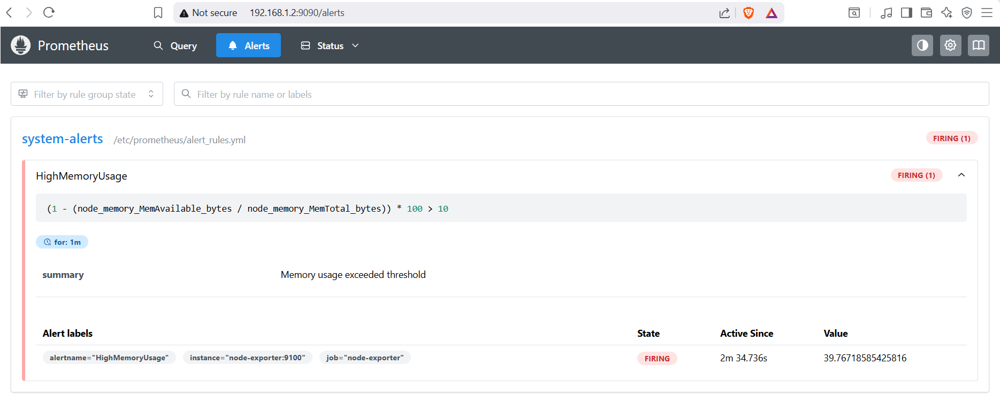
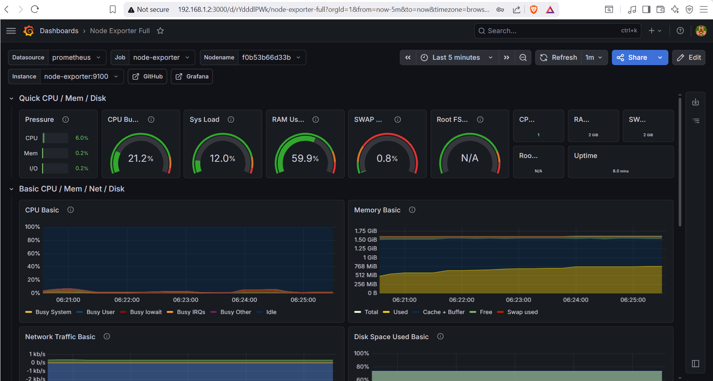
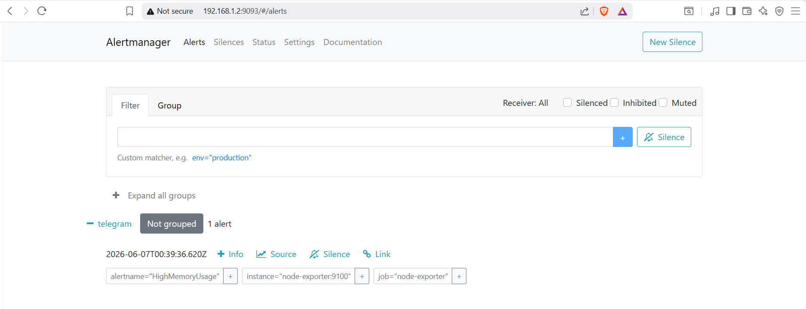
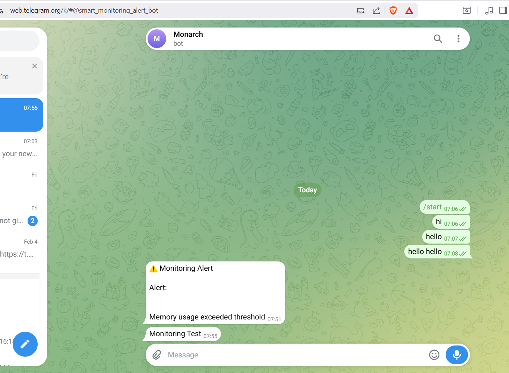

# Monitoring System with Prometheus, Grafana & Alertmanager

## 📖 Overview

This project is a self-hosted infrastructure monitoring system deployed on Ubuntu Server using Docker Compose.

It collects server metrics through Node Exporter, stores them in Prometheus, visualizes them with Grafana dashboards, and sends real-time Telegram notifications via Alertmanager whenever predefined alert conditions are triggered.

---

## 🚀 Features

- Real-time infrastructure monitoring
- CPU, Memory, Disk and Network metrics collection
- Prometheus-based monitoring and alerting
- Grafana dashboards for visualization
- Alertmanager integration
- Telegram notifications
- Containerized deployment using Docker Compose

---

## 🏗️ Architecture

```text
+--------------+
| Node Exporter|
+------+-------+
       |
       v
+--------------+
| Prometheus   |
+------+-------+
       |
       v
+--------------+
| Alertmanager |
+------+-------+
       |
       v
+--------------+
| Telegram Bot |
+--------------+

       ^
       |
+--------------+
| Grafana      |
+--------------+
```

---

## 🛠️ Technology Stack

- Ubuntu Server
- Docker & Docker Compose
- Prometheus
- Grafana
- Node Exporter
- Alertmanager
- Telegram Bot API

---

## 📂 Project Structure

```text
.
├── alertmanager/
│   └── alertmanager.yml
├── prometheus/
│   ├── prometheus.yml
│   └── alert_rules.yml
├── screenshots/
├── docker-compose.yml
└── README.md
```

---

## 📸 Screenshots

### Docker Containers Running



---

### Prometheus Targets



---

### Prometheus Alert Rules



---

### Prometheus Alert Firing



---

### Grafana Dashboard



---

### Alertmanager UI



---

### Telegram Test Notification



---

## 🔔 Alerting Workflow

1. Node Exporter collects system metrics.
2. Prometheus scrapes and stores metrics.
3. Alert rules evaluate metric thresholds.
4. Alertmanager processes triggered alerts.
5. Telegram bot sends notifications to users.
6. Grafana provides dashboard visualization.

---

## ▶️ Deployment

Start all services:

```bash
docker compose up -d
```

Check running containers:

```bash
docker ps
```

View logs:

```bash
docker compose logs -f
```

Stop all services:

```bash
docker compose down
```

---

## 📌 Example Alerts

- High CPU Usage
- High Memory Usage
- Low Disk Space
- Service Down
- Host Unreachable

---

## 👨‍💻 Author

Developed as a personal DevOps / System Monitoring project using Prometheus, Grafana, Alertmanager, and Docker Compose.
